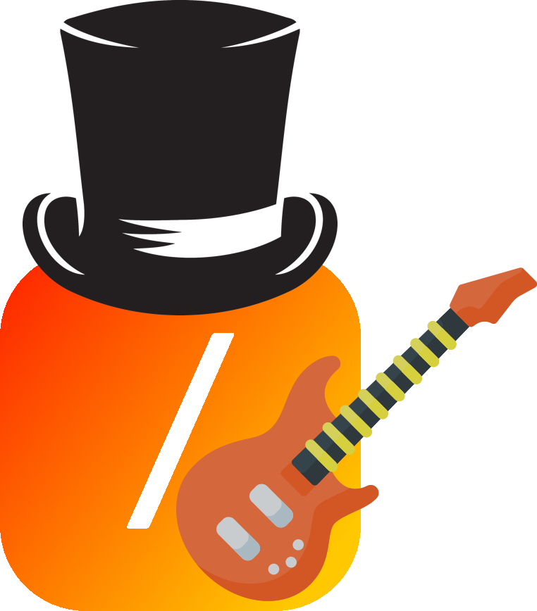

    

<h1 align="center">
    The Guitar Slasher
</h1>

    
    
    
     
    Conjunto de algoritmos que constituem um mini jogo baseado na série guitar-hero e uma IA com o sonho de ser a maior guitarrista do mundo, utilizando o mínimo de bibliotecas possível.

## 📝 To-Do List

### 🎮 Game
- [ ] Idealizar e desenvolver lógica do jogo de forma assincrona à interface;
- [ ]  Escolher música;
- [ ]  Sistema de notas e sincronização;
- [ ]  Desenvolver a Interface;
    - [ ]  Desenhar componentes do jogo;
- [ ]  Integrar o backend assícrono à interface.

### 🧠 IA
- [ ] Desenvolver RNN (MLP);
    - [ x ] Desenvolver TAD Matriz com operações básicas;
    - [ x ] Construir arquitetura da RNN (MLP);
    - [ x ] Implementar Forward;
    - [ ] Implementar Back-Propagation;
    - [ ] Salvar estado da RNN (MLP) em um arquivo;
    - [ ] Carregar estado da RNN (MLP) a partir de um arquivo.
- [ ] Integrar com algorítmo genético;
- [ ] Integrar com aprendizado supervisionado;
- [ ] Integrar com aprendizado por reforço;
    - [ ] Discretizar universo + Q-Learning;
    - [ ] Aproximador de função + Q-Learning;

## Conceitos Usados
- Computação Gráfica
- Inteligência Artificial

## 🔧 Modo de Instalar

## ⚙️ Funcionamento

## 👥 Autores

<table align="center">
    <tr>
      <td align="center">
        <a href="https://github.com/Paulo092">
             
            
              <b>Paulo Sergio</b>
            
        </a>
    </td>
      <td align="center">
        <a href="https://github.com/DayllonXavier">
             
            
              <b>Dayllon Xavier</b>
            
        </a>
    </td>
    </tr>
</table>
